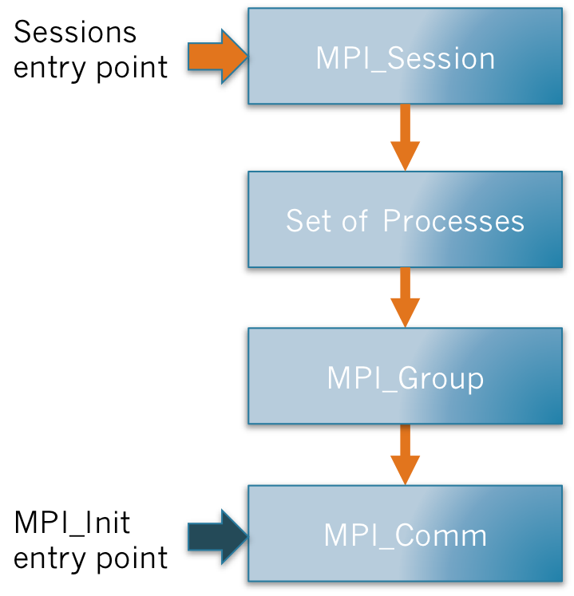
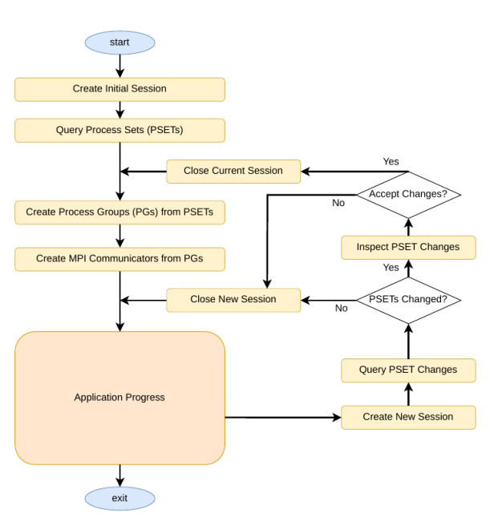

---
title:
- MPI Sessions-based Malleability
author:
- Isabel Piedrahíta Vélez
theme:
- Copenhagen
date:
- July 7, 2023
code-block-font-size: \tiny
---

# What is Malleability?

- The ability to dynamically change the number computational resources used for an application.
- Allows for more efficient resource utilization.

# Current State of Malleability in OmpSs2@Cluster

## Checkpoint and Restart - C/R

- Semitransparent.
- Requires mild changes to the source code, in order to add the sentinel.

## Dynamic Process Management - DPM

- Transparent.
- Constrained by the MPI World Model. The immutability of MPI\_COMM\_WORLD imposes limits to the minimum number, the grandularity and distribution of new proceses.

# What are MPI Sessions?

## World Model

- Only one chance to set the thread support.
- Only one MPI handle.

## MPI Models

- Allows independant initialization and use of MPI by many concurrent components.
- Freedom to change thread support.

# In Theory: Use of Sessions

{ width=250px }

# In C: Use of Sessions

~~~~~~~~~~
#include <mpi.h>

int main(int argc, char *argv[]){
	// MPI handle for the session
	MPI_Session session = MPI_SESSION_NULL;
	
	// Initialize session
	int rc = MPI_Session_init(MPI_INFO_NULL, MPI_ERRORS_RETURN, &session);
		
    // Work
    do_stuff(...)

    // Finalize session
	MPI_Session_finalize(&session);

	return(0);
} 
~~~~~~~~~~

# How do we Achieve Malleability Through MPI Sessions?

- The lack of a mandatory  WORLD\_COMM allows for mode freedom in regards to altering the way resources are used during execution.
- Sessions can be dynamically created, so that means we can change resouce usage during runtime.

# Malleability in DeepSEA

{ width=250px }
